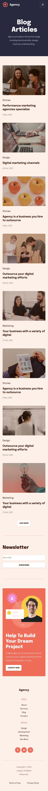
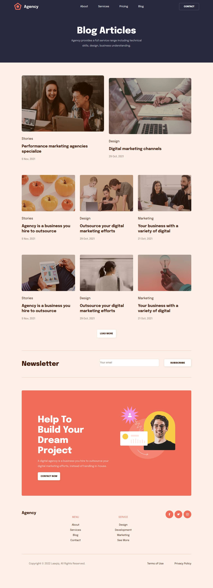

# Desafio 1 - Projeto HTML e CSS

Este é um projeto desenvolvido como parte do desafio para praticar **HTML e CSS**.

O objetivo foi reproduzir um layout utilizando apenas **HTML e CSS puro**, sem uso de frameworks.

## Design

O layout utilizado para o desenvolvimento pode ser acessado no Figma:

🔗 [Link do Figma](https://www.figma.com/design/NWDWSDEPVxse3f7sWDcF3n/Desafios-CSS-HTML?node-id=0-1&p=f&t=8MruEdZCnqh21pKJ-0)

##  Layouts

### 📱Mobile

### 💻 Desktop
