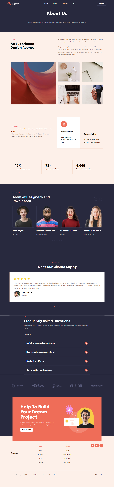

# Desafio 2 - Projeto HTML com CSS utilizando SASS

Este é um projeto desenvolvido como parte do desafio para praticar **Sass**.

O objetivo foi reproduzir um layout utilizando **HTML e CSS utilizando Sass**.

## Design

O layout utilizado para o desenvolvimento pode ser acessado no Figma:

🔗 [Link do Figma](https://www.figma.com/design/NWDWSDEPVxse3f7sWDcF3n/Desafios-CSS-HTML?node-id=0-1&p=f&t=8MruEdZCnqh21pKJ-0)

##  Layouts

### 📱Mobile

### 💻 Desktop
